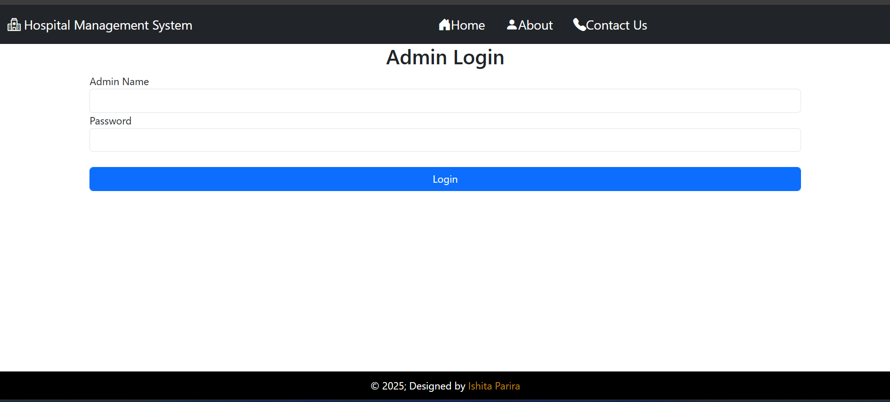
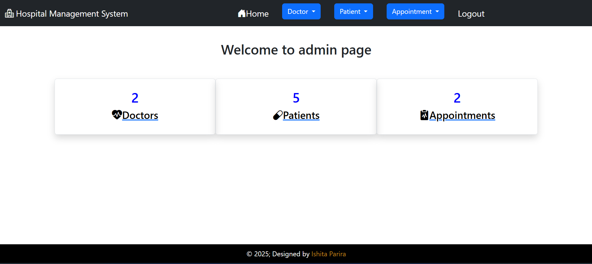
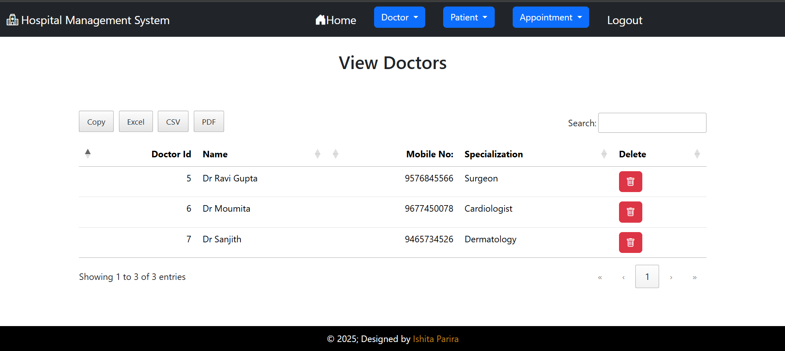
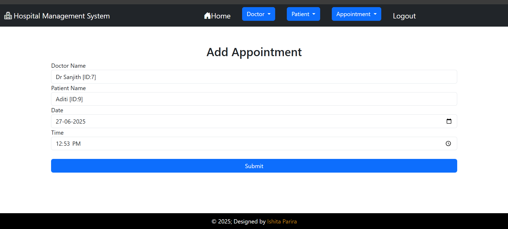

# Hospital-Management-System
Hospital Management System is a web-based application built using Django and Bootstrap.It provides role-based access for admins to manage doctors, patients, and appointments.Features include CRUD operations, responsive UI, and interactive data tables with export options.
--
## Screenshots
### Admin login

### Admin page

### Doctors list

### Add apointments

--
## Features
- Add, view, and delete:
  - Doctors
  - Patients
  - Appointments
- Export records to:
  - PDF
  - CSV
  - Excel
- Clean and responsive Bootstrap UI
---
## Tech Stack
- Django 5.2
- HTML, CSS, Bootstrap
- SQLite
---
## How to Run
1. **Clone the repository**
   ```bash
   git clone https://github.com/IshitaParira/Hospital-Management-System.git
   
2. **Move to project folder**
   ```bash
    cd Hospital-Management-System
    cd hospitalmgmt_pro

3. **Install required python packages**
   ```bash
    pip install -r requirements.txt

4. **Django setup**
   ```bash
   python manage.py makemigrations
   python manage.py migrate

5. **Create an admin user**
   ```bash
    python manage.py createsuperuser
  give admin name, email id and password

6. **Run the development server**
   ```bash
    python manage.py runserver
